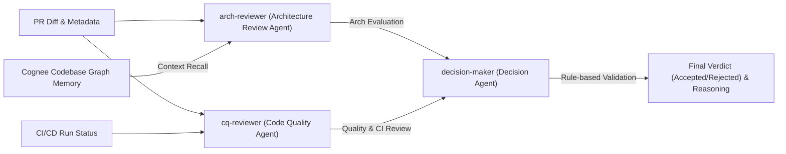

# GitSmart 🥇
A smart and autonomous developer companion platform designed to streamline code reviews and architecture analysis. By combining semantic knowledge graphs with multi-agent orchestration, the system provides automated, context-rich reviews directly on GitHub pull requests and powers an interactive codebase assistant.

---

## The Idea 💡

AI agents are great to write the code from the current context, create the pull request into the repo. No human intervention needed from the person writing the code. But what about the author reviewing 100's of pr every day, figuring out the diff, swtiching back and forth to find out if the pr is worth it or not. And if by any chance a PR is not reviewd properly and it introduces a bug immediately or later some other code is merged, the trace back and debugging becomes hell.
This is where Git Smart comes in. In an Open Source project where everyone wants to merge their PR and earn a badge, Git Smart makes it easier for the author to understand whether the created PR is actually worthy or not. It is a multi-agent platform and the memory is procided by Cognee.

Initial idea was to create a Git-compatible code hosting platform where ai agents and humans both work together to write, review and merge the code. But creating such a platform even for a demo would take weeks to show good results. Hence we stumbled upon a third-party platform that integrates with Github and ingests your repo to create a mindmap of your files.

<br/>

## How does it work?

## How is Cognee used?
Cognee is the **brain** of this platform.
- It ingests the repo, constructs the memory of the github repo, and stores all the relationships of the data, the architectural designs in it self.
- When the repo is changed, whether it is removing the code or writing new. The triggered webhook helps cognee to update its memory accordingly.
- The PR Reviewer: This is main functionality of the platform. It is not just a basic PR reviewing but an intelligent one that understand your code and immediately scans the PR, its diff, and then answers.

AI agents are excellent at generating code from current context and creating pull requests. No human intervention is needed to write the code. However, the developer reviewing hundreds of pull requests every day faces a significant burden: deciphering complex diffs, switching context to locate architectural patterns, and verifying codebase alignment. And if by any chance a PR is not reviewd properly and it introduces a bug immediately or later some other code is merged, the trace back and debugging becomes hell.

**GitSmart** solves this gap. It provides maintainers and developers with a multi-agent, context-aware code review platform. By linking a repository with **Cognee** (semantic memory engine) and **OpenClaw** (multi-agent orchestrator), GitSmart evaluates pull requests not only for style and pipeline status but also for architectural alignment against the entire codebase memory graph.

---

## How It Works ⚙️

GitSmart integrates into your development loop through webhooks and an interactive developer dashboard.

1. **Repository Ingestion**: Developers connect a GitHub repository using the dashboard. Cognee clones the repository (or ingests the Cloud target) and "cognifies" it, mapping code structure, libraries, databases, and services to a custom Software Engineering Ontology.
2. **GitHub Webhooks**: The FastAPI backend listens to webhooks from GitHub (`push`, `pull_request`, `status`, `check_run`, `check_suite`).
3. **Pending PR Queue**: When a PR is opened or updated, its metadata is stored in a pending queue, waiting for CI/CD checks to finish.
4. **Context Retrieval**: Once the CI pipeline reports completion, the review begins. GitSmart queries Cognee memory for:
   - **Infrastructure Context**: What databases, caches, frameworks, and APIs exist in the codebase.
   - **Diff-Specific Context**: Code structures and patterns related to the modified files.
   - **Duplicate Warnings**: Searches Cognee memory for duplicate or highly similar past PRs to prevent redundant code.
5. **Multi-Agent Orchestration**: OpenClaw runs a multi-agent pipeline utilizing independent specialist agents to review the PR.
6. **Verdict & Feedbacks**: The decision agent reviews all specialist outputs, makes the final status choice (Accepted/Rejected), posts a detailed, structured comment to the GitHub PR, and registers it in the local SQLite dashboard database.
7. **Continuous Memory Upgrades**: When code is pushed or a PR is accepted, Cognee memory is updated incrementally (`improve` / `forget`), making subsequent reviews even smarter.

---

## System Architecture 🏗️

The diagram below illustrates how GitSmart ingests data, intercepts webhooks, recalls repository architecture context, and coordinates multi-agent analysis to report findings to GitHub.

```mermaid
graph TD
    subgraph GitHub ["GitHub Repository"]
        PR["Pull Request / Commit Push"]
        Comment["PR Comments & Reviews"]
    end

    subgraph Webhook_Ingress ["Ingestion & Webhooks"]
        WH["GitHub Webhook Handler (/api/webhooks/github)"]
        Ingest["Repository Ingest Handler (/api/repo/ingest)"]
    end

    subgraph DB ["Local SQLite Storage"]
        sqlite[("SQLite Database<br/>(Pending PRs, Webhooks, PR Reviews)")]
    end

    subgraph Memory_Engine ["Cognee Semantic Memory (The Brain)"]
        cognee_add["cognee.add & cognify"]
        cognee_recall["cognee.recall (Semantic Context Search)"]
        cognee_ontology["Software Engineering Ontology"]
        cognee_db[("Graph Database & Vector DB")]
    end

    subgraph Multi_Agent_Orchestration ["OpenClaw Orchestration (Multi-Agent Pipeline)"]
        arch_agent["Architecture Review Agent (arch-reviewer)"]
        cq_agent["Code Quality Agent (cq-reviewer)"]
        decision_agent["Decision Agent (decision-maker)"]
    end

    PR -->|Pushes, PR events, Statuses| WH
    WH -->|Save Pending PR & status| sqlite
    WH -->|On status:completed - Trigger PR review| cognee_recall
    
    Ingest -->|Clone, add & cognify| cognee_add
    cognee_add -->|Construct relationships| cognee_ontology
    cognee_ontology -->|Store in memory| cognee_db
    
    cognee_recall -->|Retrieve diff-specific & infra context| Multi_Agent_Orchestration
    
    Multi_Agent_Orchestration -->|Evaluate codebase patterns & styles| arch_agent
    Multi_Agent_Orchestration -->|Evaluate style, security & CI results| cq_agent
    arch_agent -->|Review context| decision_agent
    cq_agent -->|Review context| decision_agent
    
    decision_agent -->|Final Decision & Reasoning| Comment
    decision_agent -->|Save finalized PR Review| sqlite
    decision_agent -->|remember_pr (Incremental memory upgrade)| cognee_add
```

---

## The AI Agents We Used 🤖

GitSmart leverages a modular multi-agent orchestration paradigm. The agents communicate and execute workflows using the **OpenClaw SDK**. Below is a summary of the agents, their specific roles, and their decision-making logic:



### 1. Architecture Review Agent (`arch-reviewer`)
* **Role**: Validates architectural alignment and structural conformance.
* **Inputs**: The PR title, code diff, and semantic architecture context retrieved from Cognee memory.
* **Details**: Inspects whether the PR changes align with the codebase's existing structures, design patterns, and choices (e.g. database schemas, service wrappers, folder structures, and imports).

### 2. Code Quality Agent (`cq-reviewer`)
* **Role**: Evaluates code cleanliness, security risks, performance bugs, and CI/CD results.
* **Inputs**: The PR title, code diff, and CI build results.
* **Details**: Analyzes formatting, code structure, potential security vulnerabilities, and runtime risks. If the CI build failed, it notes the pipeline failure but is instructed to evaluate the quality of the code changes independently to provide meaningful feedback (e.g. *"The code changes themselves are solid, but the CI/CD pipeline did not pass."*).

### 3. Decision Maker Agent (`decision-maker`)
* **Role**: The final gatekeeper that makes the ultimate recommendation.
* **Inputs**: Architecture review output, Code Quality review output, CI/CD run status, and duplicate warnings from Cognee.
* **Details**: Evaluates all analyses and applies strict validation rules. Under strict criteria, if the CI/CD pipeline failed, it automatically sets the final status to **Rejected**. It formats the final results as a structured JSON object containing:
  - `status`: Either `Accepted` or `Rejected`.
  - `reasoning`: A compiled developer-focused summary of the decision.
  - `architecture_review`: Detailed feedback on design alignment.
  - `quality_review`: Detailed feedback on style and code security.

### 4. Chatbot Assistant Agent (`chat-assistant`)
* **Role**: Interactive codebase companion and Q&A expert.
* **Inputs**: User's natural language queries, full Cognee architecture context, and historical context of selected PR reviews.
* **Details**: Powers the interactive chat on the dashboard. Developers can ask questions like *"Why was PR #12 rejected?"*, *"Will this database model work in our codebase?"*, or *"Which helper modules should I use to wrap external APIs?"*, and receive rich, developer-centric answers.

---

## How Cognee is Used 🧠

Cognee is the **semantic brain** of the GitSmart platform. It stores relationships, dependency graphs, and structural schemas of the ingested codebase.

### Custom Software Engineering Ontology
In [ontology.py](file:///home/rashu/Git-smart/backend/ontology.py), GitSmart defines a specialized schema containing Pydantic-based `DataPoint` entities:
- `AIAgent`: Represents autonomous AI agents/LLM wrappers.
- `SoftwareFramework`: Represents frameworks/libraries used (e.g., FastAPI, Next.js).
- `Infrastructure`: Databases, queues, caches (e.g., SQLite, Redis).
- `CodeArtifact`: Files, classes, methods in the codebase.
- `SoftwareComponent`: Microservices, APIs, internal modules.
- `Developer`: Contributors, authors.
- `PullRequest`: Stored PR reviews with numbers, title, diffs, status, reasoning.

### Incremental Memory Synchronization
When code is updated:
- **Pushes**: A GitHub `push` webhook triggers Cognee (`improve` / `forget`) to add, modify, or remove nodes in the codebase graph.
- **Reviewed PRs**: Once a PR is reviewed, its diff and final reasoning are registered in Cognee memory (`cognee_service.remember_pr`), enabling the agent to learn from historical PR comments.

### Duplicate PR Detection
Prior to reviewing, GitSmart asks Cognee to search memory for similar PR content (`cognee_service.check_duplicate_pr`). If another developer has already submitted a similar diff or title, GitSmart raises duplicate warnings to the decision agent.

---

## Technology Stack 💻

### Backend
- **Framework**: FastAPI (Python)
- **Database**: SQLite (SQLAlchemy ORM)
- **Orchestration & Graph Memory**: OpenClaw SDK & Cognee SDK
- **Data Pipelines**: DLT (Data Load Tool)

### Frontend
- **Framework**: Next.js (App Router, TypeScript)
- **Styling**: Tailwind CSS
- **Icons**: Lucide React

---

## Setup & Running Guide 🛠️

### Prerequisites
Ensure you have the following installed:
- Python 3.10+
- Node.js 18+
- Smee Client (for forwarding GitHub Webhooks locally)

### Configuration (`.env`)
Create a `.env` file in the `backend/` directory with the following variables:
```ini
GITHUB_WEBHOOK_SECRET="your_webhook_secret"
GITHUB_PAT_TOKEN="your_github_personal_access_token"
DATABASE_URL="sqlite:///./dashboard.db"

# LLM Providers (Gemini / LiteLLM)
GEMINI_API_KEY="your_gemini_api_key"
LLM_PROVIDER="gemini"
LLM_MODEL="gemini/gemini-3.1-flash-lite"
LLM_API_KEY="your_gemini_api_key"

EMBEDDING_PROVIDER="litellm"
EMBEDDING_MODEL="gemini/gemini-embedding-2"

# Cognee Service Configuration
COGNEE_SERVICE_URL="your_cognee_url"
COGNEE_API_KEY="your_cognee_api_key"

# OpenClaw Configuration
OPENCLAW_BASE_URL="http://127.0.0.1:18789"
OPENCLAW_API_KEY="your_openclaw_api_key"
```

### Running the Backend
1. Initialize virtual environment and install dependencies:
   ```bash
   cd backend
   python -m venv venv
   source venv/bin/activate
   pip install -r requirements.txt
   ```
2. Start the FastAPI server:
   ```bash
   uvicorn main:app --reload --port 8000
   ```

### Running the Frontend
1. Install node modules:
   ```bash
   cd frontend
   npm install
   ```
2. Start the Next.js development server:
   ```bash
   npm run dev
   ```
   The dashboard will be available at `http://localhost:3000`.

### Forwarding GitHub Webhooks
To test locally, use `smee-client` to forward webhook requests to your FastAPI endpoint:
```bash
smee --url https://smee.io/your_smee_channel_id --path /api/webhooks/github --port 8000
```
*(Make sure to set this Smee URL as the Webhook URL in your GitHub Repository settings).*

